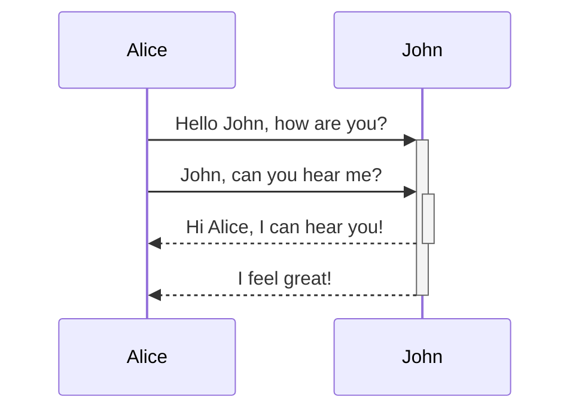

- 内部链接，就是双链的形式
 >Link  to a page: [[2022-03-09]]

 Link to a page : [[2022-03-09]]

 ---
- 嵌入文档，就是双链到内部section，页面名称后面跟上#，如下，直接把指定页面内容加入到当前页面
```md
 ![[obsidian链接的应用#双链的相关操作]]
```

> ![[obsidian链接的应用#双链的相关操作]]

---
- Headers
> # Heading1
> ## Heading2
> ### Heading3
> #### Heading4
> ##### Heading5
> ###### Heading6

```html
	# Heading1
	## Heading2
	### Heading3
```

 # Heading1
 ## Heading2
 ### Heading3

 用>开头的blockquote，## 这些依旧会有效果，但是，codeblock，····html这种开头的，##这些就没有效果了，只是文本文字了


---
 - 强调 
	 ```markdown
		 *This text will be italic*
		 _This will also be italic_
	 ```
	 
	 *This text will be italic*
	 _This will also be italic_
  *和_，与后面的字符之间没有空格，结尾也需要对应 * 和 _


```markdown
		 **This text will be bold**
		 __This will also be bold__
```

 **This text will be bold**
 __This will also be bold__

 ```md
	 _You **can** combine them_
 ```
	 
 _You **can** combine them_

 这些文本，带了格式，需要左对齐，最左，才能正常显示，否则右移之后，会显示出红色

---
 - 列表
 ```md
	 - Item1
	 - Item2
		 - Item2a
		 - Item2b
	 1. Item1
	 1. Item2
	 1. Item3
		 1. Item3a
		 1. Item3b
 ```

 - Item1
 - Item2
	 - Item2a
	 - Item2b
1. Item1
1. Item2
2. Item3
	1. Item3a
	2. Item3b

	有序清单，都是用1开头，效果显示出来，是有1、2、3序号的	

---
- 图像
```md

```
图像按照原有的高度、宽度显示
和嵌入文档代码类似，`` 也表示是嵌入的文档类型， 和图像类似


---
- 调整图像尺寸
```md

```
竖线后面的数字，设置图像的宽度


---
- 链接
	- 外部链接: 可以指向外部web链接，或者内部页面，内部图片
```md
http://obsidian.md - automatic!
[Obsidian](http://obsidian.md)

```

http://obsidian.md - automatic!
[Obsidian](http://obsidian.md)

---
- obsidian uri链接: 用来在obsidian打开另外vault或者程序
		例：链接到一个vault的文件
```md
	[Link to note](obsidian://open?path=D:%2Fpath%2Fto%2Ffile.md)
```


[Link to note](obsidian://open?path=D:%2Fpath%2Fto%2Ffile.md)

- [ ] 为何前面的链接代码前面有tab或者空格，就变成红色了

---
- 转义
	url中有空格，可以用%20表示，也可以用<>包括起来
```md
	[Export options](Pasted%20image)
	[Export options](<Pasted image>)
```


[Export options](Pasted%20image)
	双击，就能创建一个新的note文件
	[Export options](<Pasted image>)

-[x] 为啥上面第二个缩进就不显示红色呢？第一行缩进就变红了
	在reading view里面，显示红色的内容，就是一个可以copy的block，和三个反引号效果类似

---
- 块引用
```md
> Human .....
\- Doug , 1961
```


> Human .....

\- Doug , 1961

---
- inline 代码
```md
	Text inside `backticks` on a line ...
```


Text inside `backticks` on a line ...

---
- 代码块
	支持语法高亮，使用prismjs， 参见[prismjs支持的语言种类](https://prismjs.com/#supported-languages)

```md
```js
function fancyAlert(arg) {
  if(arg) {
    $.facebox({div:'#foo'})
  }
}
```


```js
function fancyAlert(arg) {
  if(arg) {
    $.facebox({div:'#foo'})
  }
}
```

---
- 任务清单
```md
- [x] #tags, [links](), **formatting** supported
- [x] list syntax required (any unordered or ordered list supported)
- [x] this is a complete item
- [?] this is also a complete item (works with every character)
- [ ] this is an incomplete item
- [ ] tasks can be clicked in Preview to be checked off
```

- [x] #tags, [links](), **formatting** supported
- [x] list syntax required (any unordered or ordered list supported)
- [x] this is a complete item
- [?] this is also a complete item (works with every character)
- [ ] this is an incomplete item
- [ ] tasks can be clicked in Preview to be checked off

---
- 表格
 ```md
First Header | Second Header
------------ | ------------
Content from cell 1 | Content from cell 2
Content in the first column | Content in the second column
 ```


First Header | Second Header
------------ | ------------
Content from cell 1 | Content from cell 2
Content in the first column | Content in the second column

```md
Tables can be justified with a colon | Another example with a long title
:----------------|-------------:
because of the `:` | these will be justified
```

Tables can be justified with a colon | Another example with a long title
:----------------|-------------:
because of the `:` | these will be justified

：用来表示左右对齐

\| 用来表示piped links

```md
First Header | Second Header
------------ | ------------
[[Format your notes\|Formatting]]	|  [[Keyboard shortcuts\|hotkeys]]
```


First Header | Second Header | Third Header
------------ | ------------  | ---------:
[[Format your notes\|Formatting]]	|  [[Keyboard shortcuts\|hotkeys]] | [[2022-03-10 \|link]]


\| 前面的内容代表note的标题，后面的内容代表链接的标题


----
- 流程图
	使用  [Mermaid](https://mermaid-js.github.io/)，还有[一个编辑器](https://mermaid-js.github.io/mermaid-live-editor)
```md



